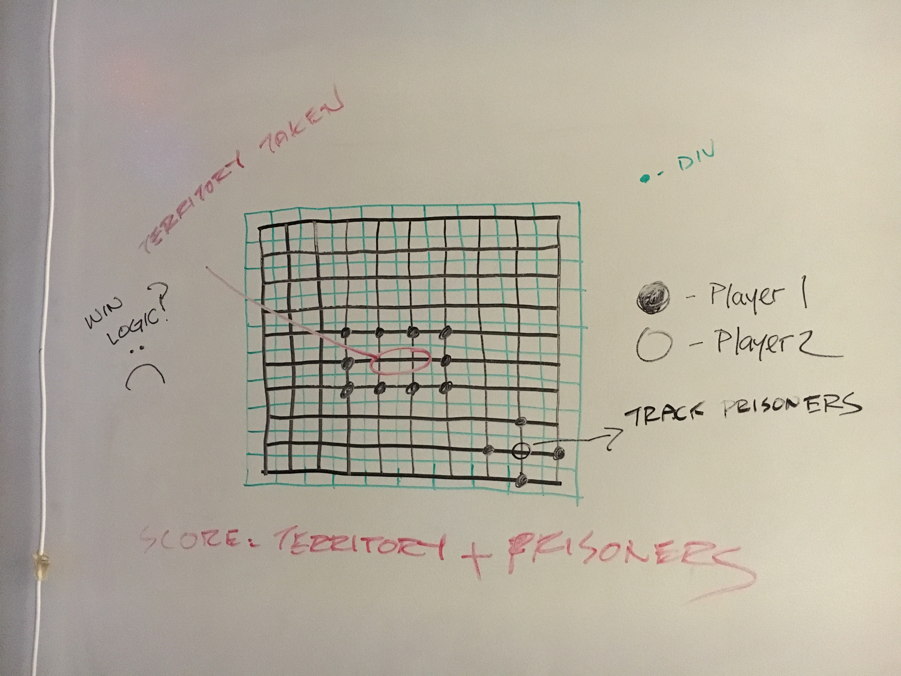
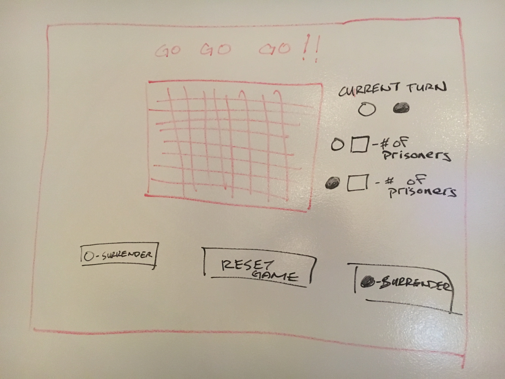

#Project01 - Faux Go!

##Introduction

Welcome to Faux Go!,  A basic version of the classic game that has existed for generations!  The object of this game is to place the pieces on the board to capture territory.  Surround the opposing pieces and claim them as your prisoners!  Black always goes first.  Whoever traps 3 pieces first wins.  **_GOOD LUCK!!!_**

##Technologies Used

HTML, CSS, Javascript and JQuery were used to create this Game.

##Approach

Go is a simple game of strategy that can become quite complex.  What you have before you is a simplified version which tracks single piece capture events.  In order to make the game work I used HTML and CSS to create a game board and Javascript to built my game logic.  I also utilized JQuery to track the pieces on the board as well as score tracking.

##Unsolved Problems/Reach Goals

I haven't yet been able to figure out how to remove captured pieces from the game board.

The Endgame here is still to create a full game logic that not only tracks single captures, but multiple piece captures as well as territory tracking.

##User Stories

Click Here for [User Stories](https://trello.com/b/idPf1BgD/project-1-go-go-go)

##Wireframes

##Installation Instructions

Navigate to www.github.com/darinmma/Project01 and clone the respository.
